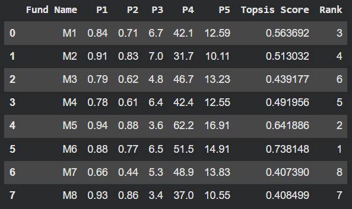
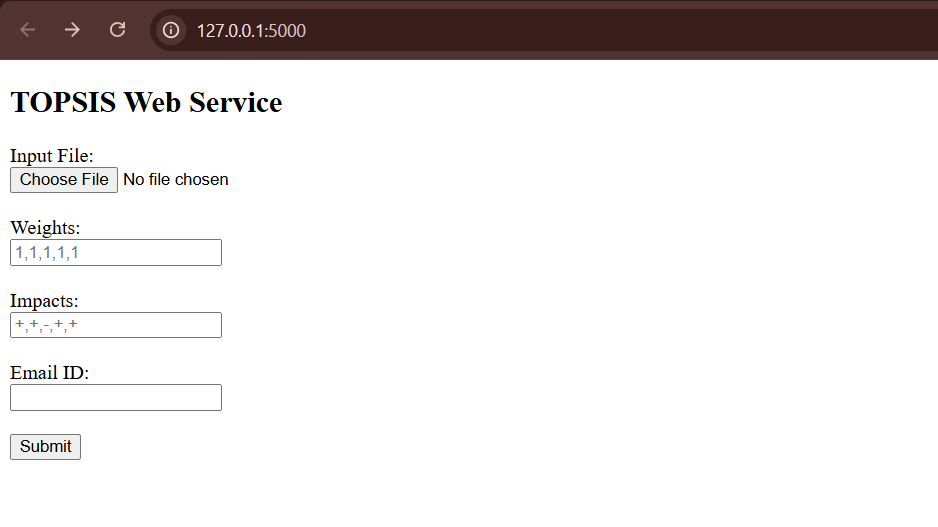
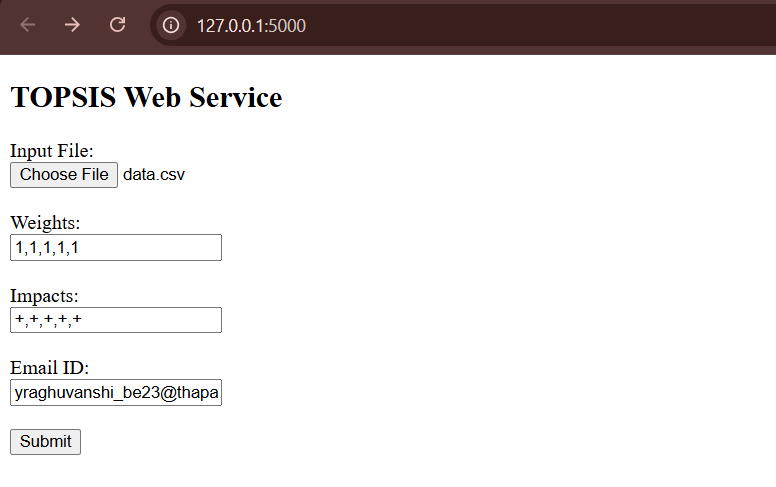
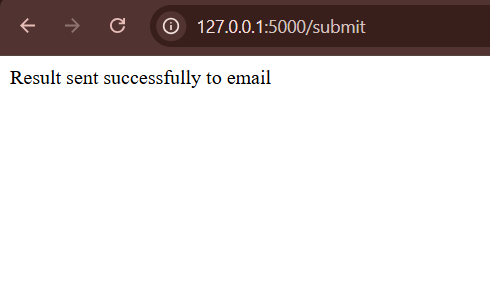
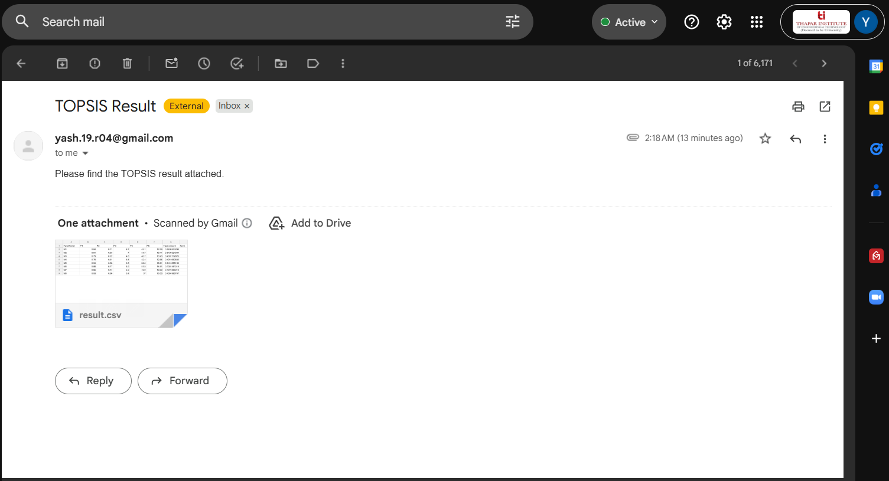

# TOPSIS Assignment 

## PART-1: Implementing TOPSIS

### Overview
This project implements the TOPSIS (Technique for Order Preference by Similarity to Ideal Solution)
method in Python to rank alternatives based on multiple criteria.

---

### Methodology
1. Read input data from a CSV/Excel file.
2. Normalize the decision matrix.
3. Apply user-defined weights.
4. Determine ideal best and ideal worst based on impacts.
5. Compute Euclidean distances.
6. Calculate TOPSIS score and rank alternatives.

---

### Input Format
- First column: Alternative names
- Remaining columns: Numeric criteria
- Weights and impacts provided via command line

Example:
```bash
python topsis.py data.csv "1,1,1,1,1" "+,+,+,+,+" output.csv
```
---

### Output Format


## PART-3: TOPSIS Web Service

### Overview
In Part-III, a web service for the TOPSIS algorithm is developed using Flask.
The service provides a web-based interface where users can upload an input file,
enter weights, impacts, and an email ID to receive the TOPSIS result.

---

### Features
- Web-based form to upload input file
- Accepts weights and impacts as comma-separated values
- Validates email format, weights, and impacts
- Executes TOPSIS on the server
- Sends the result file (`result.csv`) to the user via email

---

### Web Interface Inputs
The user provides:
- Input CSV file
- Weights (comma separated)
- Impacts (`+` or `-`, comma separated)
- Valid email ID

---

### Working
1. The user submits the form through the web interface.
2. The server validates inputs (email, weights, impacts).
3. TOPSIS computation is performed on the uploaded file.
4. The result file is generated and emailed to the user.

---

### Local Execution
The web service runs locally using Flask on: http://127.0.0.1:5000

---

### Files Used
- `app.py` : Flask web service backend
- `templates/index.html` : Web form interface
- `uploads/` : Stores uploaded input files
- `output/` : Stores generated TOPSIS result file

---

### Demonstration
1. required input
   
2. user entered input
   
3. email sent confirmation
   
4. output received by user via mail
   

---

### Note
The web service is implemented and demonstrated locally using `localhost`.


